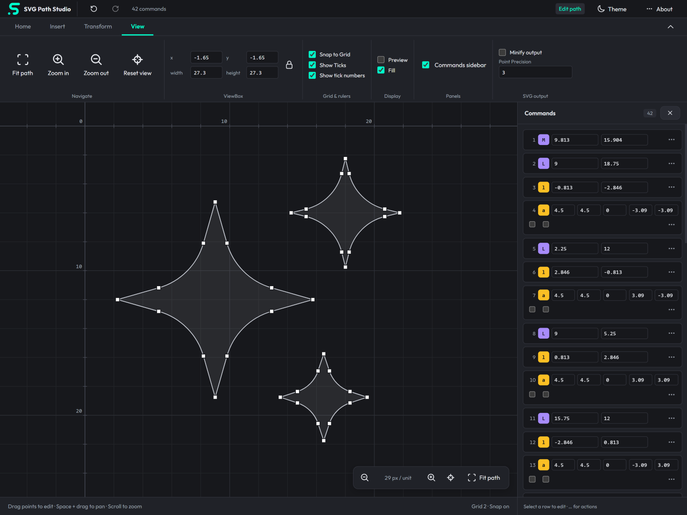

# SVG Path Studio

**Edit SVG paths with precision — in your browser, no framework attached.**

SVG Path Studio is an online editor for creating and manipulating SVG path data: paste a path, drag points, insert commands, apply transforms, optimize the output — all client-side.

[Open SVG Path Studio](https://bookklik-technologies.github.io/svg-path-studio/)



Distributed under the [MIT License](./LICENSE).

## Features

- **Interactive canvas** — drag endpoints and bézier control handles, snap to grid (hold `Ctrl` to bypass), pan by drag, zoom with the wheel or the toolbar
- **Command panel** — one row per path command; click the type chip to toggle relative/absolute (orange = relative, violet = absolute); per-row menu: insert after, convert to, start path/subpath from here, reverse subpath, delete
- **Path operations** — scale, translate, rotate, round coordinates, convert to relative/absolute, reverse, and a 7-flag optimizer (shorthand promotion, H/V lines, shortest relative/absolute form, reverse-if-shorter, and more)
- **ViewBox tools** — manual X/Y/width/height fields with aspect lock, zoom in/out/reset, fit to path
- **I/O** — open/save path files, SVG import, export as SVG with style + live preview, copy to clipboard, shareable URLs that encode the whole session
- **Sessions** — persists locally, works offline via service worker, dark/light themes
- **Shortcuts** — `m l v h c s q t a z` insert commands, `Shift` + same converts the selection, `Esc` cancels, `Del` deletes, `Ctrl+Z` / `Ctrl+Shift+Z` undo/redo

## Packages

| Package | Purpose |
|---|---|
| [`packages/core`](./packages/core) | `@svg-path-studio/core` — zero-dependency path engine: parser, serializer, transforms, conversions, reverse, optimize. Usable standalone in Node or the browser. |
| [`packages/app`](./packages/app) | The editor application — framework-free TypeScript + Vite. |

## Development

```bash
pnpm install
pnpm -r build      # build core + app
pnpm -r test      # unit + property tests
pnpm dev          # editor at http://localhost:5173
```

Requires Node ≥ 18 and pnpm ≥ 9.

## GitHub Pages

1. Push this project to [`bookklik-technologies/svg-path-studio`](https://github.com/bookklik-technologies/svg-path-studio) with a `main` branch.
2. In the repository's **Settings → Pages**, select **GitHub Actions** as the build and deployment source.
3. Run **Deploy to GitHub Pages** from the **Actions** tab, or push a new commit to `main`.

The workflow installs the pinned pnpm version from `package.json`, builds the core and app, and publishes `packages/app/dist` to https://bookklik-technologies.github.io/svg-path-studio/. The deployment URL also appears in the workflow's `github-pages` environment.

The app uses relative asset and service worker URLs, so the same build supports a repository subpath, an `<owner>.github.io` repository, or a custom domain without changing the Vite base. The Pages workflow runs the production build; the existing CI workflow handles its own checks.

## Core usage

```typescript
import { SpsPath, reversePath, optimizePath } from '@svg-path-studio/core';

const path = new SpsPath('M 4 8 L 10 1 C 6 10 6 11 7 10 A 1.42 1.42 0 0 1 6 13 Z');

path.scale(2, 2);
path.translate(1, 0);
path.setRelative(true);

reversePath(path);
optimizePath(path, { useShorthands: true, useHorizontalAndVerticalLines: true });

console.log(path.asString(4, true)); // minified
```

Invalid input throws `SpsParseError` with the exact character index and reason.
